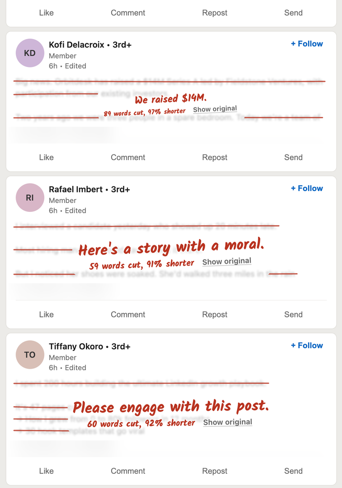

# Says Who

A Chrome extension for X (formerly Twitter). When someone who builds, sells or invests in AI posts about AI, it writes one line under the post, in red pen, saying what they gain from telling you.



A fork of [In Other Words](https://github.com/og2701/in-other-words) by Owen Greenhalgh. See [Credits](#credits).

## What it does

A post gets a note when it is a take on AI (an opinion, prediction or claim, including ones that never name it, like "coding is solved") and its author is paid by AI: an employee, a founder, an investor, or someone selling a course or service.

The note is one fixed sentence about what the author gains:

- "Says the person selling AGENTIC TESTING."
- "Says someone whose paycheck comes from OpenAI."
- "Says someone whose money is riding on it."

Hover over a note to see what it rests on: the author's profile, what they say in the post, or, for well-known accounts, the model recognising who they are. The post itself is never hidden or changed.

It can be wrong. It only knows what a profile or post says, a bio can be out of date, and borderline posts can be judged differently from one run to the next. A note means "this person has a stake", not "this is wrong".

## Install

1. Take `says-who-v1.0.0.zip` from the [`release`](release) folder and unzip it.
2. Open `chrome://extensions`, turn on **Developer mode**, click **Load unpacked** and choose the unzipped folder.
3. Get an API key at [console.typesafe.ai](https://console.typesafe.ai). On the settings page that opens (or right-click the icon, **Options**), paste it and click **Save and test**.
4. Reload any open X tabs.

## Use

Scroll X. Notes appear under posts as they come into view. Click the extension's icon to pause it, see how many posts it has marked, and check what it found on the current page. Settings let you change how sure the model has to be.

## Privacy and cost

Says Who uses [TypeSafe](https://typesafe.ai)'s Jev model with your own key.

- **Sent to TypeSafe:** a post and its author's public name, handle, bio, profile link, badge and professional category. Only when the post or profile shows signs of being about AI, or the author was found to be paid by AI in the last 30 days.
- **Not sent:** anything about your own account, or any other post.
- **Kept in your browser:** your key and all results. A post is only sent once.
- **Requests to X:** none. It reads the profiles X already loads.

Roughly 12 cents per 1,000 posts sent, worked out from the request size, not from a bill.

## Development

```sh
npm install        # only needed for the browser tests
npm test           # unit tests
npm run e2e        # headless Chromium against a test timeline (-- --mock skips real Jev)
npm run eval       # sample posts through real Jev (needs TYPESAFE_API_KEY)
npm run build      # packs extension/ into release/
```

Wording and what counts are in [`extension/lib/stakes.js`](extension/lib/stakes.js). If X changes its layout, the selectors are at the top of [`extension/content.js`](extension/content.js), and the profile reader is [`extension/page.js`](extension/page.js).

## Credits

Says Who is a fork of **[In Other Words](https://github.com/og2701/in-other-words)** by **Owen Greenhalgh**, which crosses out verbose LinkedIn posts and writes, in red pen, the one sentence they're actually saying. The idea of answering a post in red handwriting is his, and so is most of what makes this one work: the worker and content-script design, the Jev client and caching, turning the model's answers into fixed sentences with ordinary code, the handwriting and its animation, the popup and settings pages, and the build and test setup.

This fork moves it to X, reads authors' profiles, asks different questions, and adds a line under the post instead of writing over it. It is a separate extension, not maintained or endorsed by the original's author, and its mistakes are its own.

Also: [TypeSafe](https://typesafe.ai) for Jev, and [Kalam](https://github.com/itfoundry/kalam), the handwriting typeface by the Indian Type Foundry, under the SIL Open Font License ([`extension/fonts/OFL.txt`](extension/fonts/OFL.txt)).

## Licence

MIT, the same as the original. Both copyright notices are in [`LICENSE`](LICENSE).
